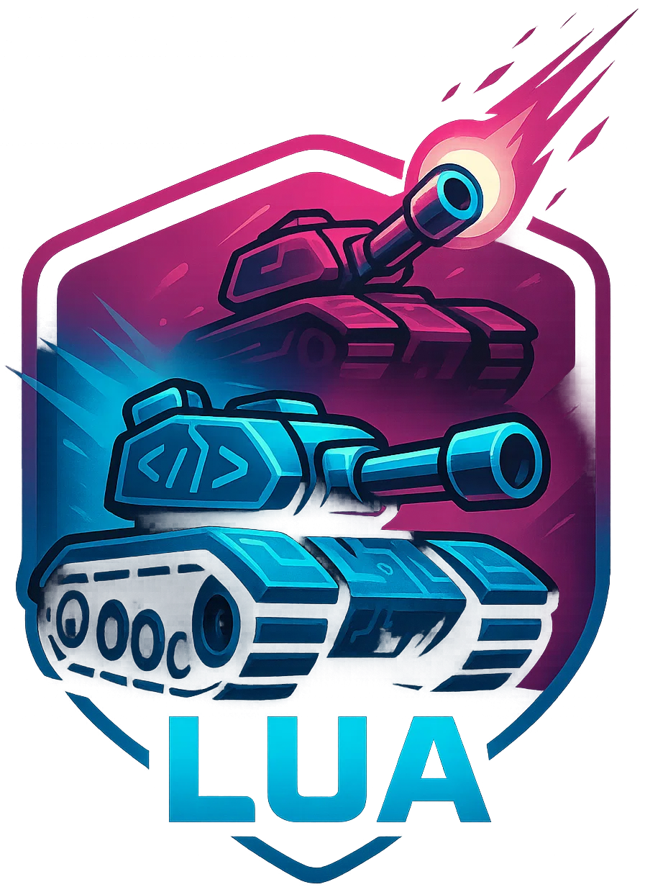

# TanksAI

**TanksAI** is a Unity-based project focused on creating a tank combat environment where autonomous agents, controlled by Lua scripts, can engage in battles. This project serves as a sandbox for developing and testing various AI algorithms and techniques in a game setting.

## ⚠️ Project Status: Under Development

This project is currently in the early stages of development. As such, it is subject to major changes, and features may be added, removed, or modified without notice. The primary focus is on building a robust foundation for Lua-driven AI within the Unity engine.

## 🚀 Core Features

*   **Lua-Powered AI:** Tank agents are controlled by Lua scripts, allowing for dynamic and easily modifiable AI behaviors.
*   **Unity Integration:** A custom C# framework provides the bridge between the Unity game engine and the Lua scripting environment.
*   **AI Algorithm Playground:** The project is designed to be a flexible platform for experimenting with various AI patterns, such as Finite State Machines (FSMs), Hierarchical Finite State Machines (HFSMs), and Behavior Trees.

## 📝 Development Roadmap

The project's development is tracked in the `TODO.md` file. This file contains a list of planned features, tasks, and bug fixes. It provides a high-level overview of the project's direction and priorities.

---

> This README.md file was generated by a Large Language Model (LLM) to provide an overview of the project based on its source code.

> Last update time: 2025-10-27 20:19
